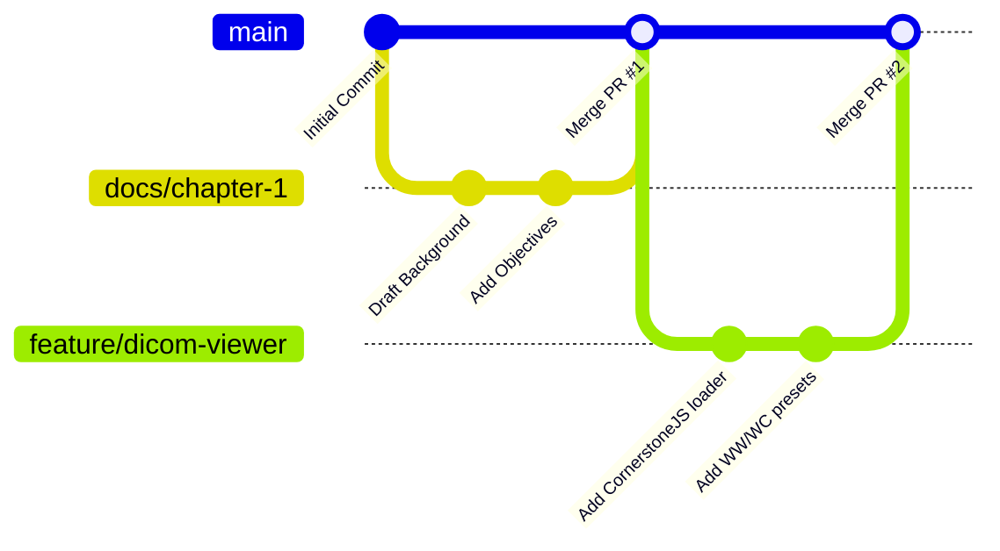

# 🤝 Capstone Team Collaboration & Git Workflow Guidelines

To ensure smooth collaboration, accountability, and seamless defense preparation, all team members must follow these workflow conventions.

---

## 1. Branching Strategy

We follow a **Trunk-Based / Feature-Branch** workflow:



### Branch Naming Conventions:
* `feature/<feature-name>`: Development of functional code modules (e.g. `feature/triage-queue`, `feature/auth-jwt`).
* `docs/<chapter-or-section>`: Thesis documentation and manuscript chapters (e.g. `docs/chapter-3-methodology`, `docs/rrl-synthesis`).
* `research/<experiment-name>`: ML training, dataset curation, or Jupyter notebooks (e.g. `research/vit-fine-tuning`).
* `fix/<bug-description>`: Bug fixes and critical corrections (e.g. `fix/dicom-rendering-safari`).

---

## 2. Commit Message Convention (Conventional Commits)

Format: `<type>(<scope>): <short description>`

### Types:
* `feat`: A new feature or deliverable module.
* `docs`: Documentation, thesis manuscript chapters, or README updates.
* `fix`: Bug fix in code or correction in manuscript equations/citations.
* `refactor`: Code or writing refactor without changing functionality.
* `test`: Adding unit tests, evaluation scripts, or survey tabulations.
* `chore`: Package updates, build configurations, or file reorganization.

### Examples:
```bash
git commit -m "docs(chapter-2): add 15 new citations comparing ViT with ResNet-50"
git commit -m "feat(viewer): implement Hounsfield Unit window level presets"
git commit -m "fix(auth): rotate JWT refresh tokens on expiry"
```

---

## 3. Pull Request (PR) Policy

1. **Never push directly to `main`**. Always create a branch and open a Pull Request.
2. Fill out the **[Pull Request Template](./.github/PULL_REQUEST_TEMPLATE.md)**:
   - Link related CapStoneFlow / GitHub issue.
   - Describe what was changed.
   - Attach screenshot / demo link.
3. **Mandatory Peer Review:** Every PR requires at least **1 approval** from another team member before merging.
4. Keep branches short-lived (merge within 2–4 days to prevent merge conflicts).

---

## 4. Documentation Protocol

* When writing manuscript chapters in `docs/chapters/`, write in standard GitHub Markdown.
* Store citation keys in Zotero / BibTeX format.
* Any adviser or panel feedback must immediately be logged into **`docs/revisions/REVISION_MATRIX.md`** and recorded in the CapStoneFlow web app.
