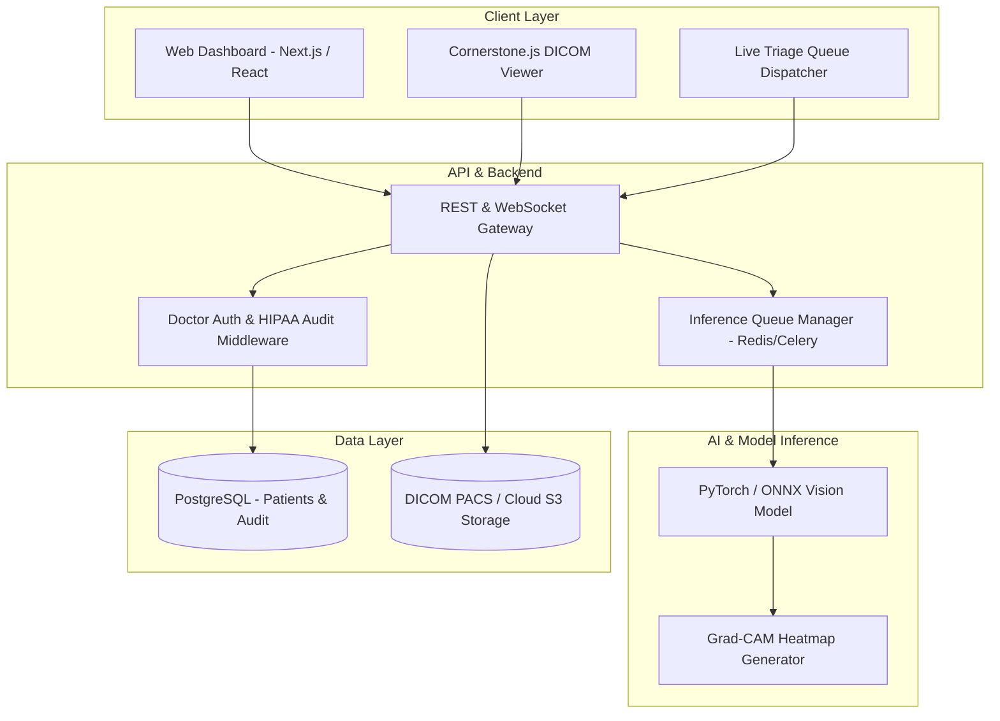

# 🎓 MediScan AI: Multi-Modal Clinical Workflow & Diagnostic Triaging System

[](./docs/chapters/CHAPTER_3_METHODOLOGY.md)
[](./docs/README.md)
[](./LICENSE)

An intelligent decision-support web platform integrating deep learning computer vision and automated EHR analytics for regional clinical emergency triaging.

---

## 👥 Team Roster & Academic Supervision

| Role | Name | Specialization / Focus Area | Contact |
| :--- | :--- | :--- | :--- |
| **Project Lead** | **Alex Vance** | Full-Stack Architecture, API Security & DevOps | `alex.vance@student.edu` |
| **ML Engineer** | **Marcus Chen** | Deep Learning, PyTorch, ONNX Quantization | `marcus.chen@student.edu` |
| **Frontend / UI/UX** | **Sophia Patel** | React, Cornerstone.js DICOM Viewer, Design System | `sophia.patel@student.edu` |
| **Lead Technical Writer & QA** | **David Kim** | ISO/IEC 25010 Quality Evaluation, Manuscript Drafting | `david.kim@student.edu` |
| **Capstone Adviser** | **Dr. Arthur C. Martinez, Ph.D.** | Faculty Adviser, Department of Computer Science | `a.martinez@university.edu` |

---

## 📁 Repository Directory Structure

```
├── .github/                       # GitHub workflows & team templates
│   ├── ISSUE_TEMPLATE/            # Academic task & revision issue templates
│   └── PULL_REQUEST_TEMPLATE.md   # Standard PR template with chapter links
├── docs/                          # Complete Thesis Manuscript & Academic Docs
│   ├── chapters/                  # Chapters 1 to 5 Markdown source drafts
│   │   ├── CHAPTER_1_INTRODUCTION.md
│   │   ├── CHAPTER_2_LITERATURE_REVIEW.md
│   │   ├── CHAPTER_3_METHODOLOGY.md
│   │   ├── CHAPTER_4_RESULTS_AND_DISCUSSION.md
│   │   └── CHAPTER_5_CONCLUSION_AND_RECOMMENDATIONS.md
│   ├── revisions/                 # Official Adviser Revision Compliance Matrix
│   │   └── REVISION_MATRIX.md
│   ├── minutes/                   # Weekly standups & adviser consultation minutes
│   │   └── MEETING_MINUTES_TEMPLATE.md
│   └── architecture/              # System block diagrams, ERDs, API contracts
│       └── SYSTEM_ARCHITECTURE.md
├── src/                           # Source code (Web Platform & CapStoneFlow Tracker)
│   ├── components/                # Modular UI components (Kanban, Gantt, Reports)
│   ├── context/                   # State management & persistent storage
│   ├── types/                     # TypeScript definitions
│   └── data/                      # Initial project schema & fixtures
├── CONTRIBUTING.md                # Team git branching & commit guidelines
└── README.md                      # Project master overview
```

---

## 🏛️ System Architecture



---

## 📖 Thesis Manuscript Quick Links

* 📄 **[Chapter 1: Introduction & Problem Background](./docs/chapters/CHAPTER_1_INTRODUCTION.md)**
* 📄 **[Chapter 2: Review of Related Literature & Studies (RRL)](./docs/chapters/CHAPTER_2_LITERATURE_REVIEW.md)**
* 📄 **[Chapter 3: Methodology & System Architecture](./docs/chapters/CHAPTER_3_METHODOLOGY.md)**
* 📄 **[Chapter 4: Results, Analysis & Evaluation](./docs/chapters/CHAPTER_4_RESULTS_AND_DISCUSSION.md)**
* 📄 **[Chapter 5: Summary, Conclusions & Recommendations](./docs/chapters/CHAPTER_5_CONCLUSION_AND_RECOMMENDATIONS.md)**
* 📝 **[Adviser Revision Compliance Matrix](./docs/revisions/REVISION_MATRIX.md)**

---

## 🚀 Running the Platform Locally

### Prerequisites
* **Node.js**: v18.0 or higher
* **npm**: v9.0 or higher

### Setup Instructions
```bash
# 1. Clone the repository
git clone https://github.com/your-team-org/capstone.git
cd capstone

# 2. Install dependencies
npm install

# 3. Launch development server with CapStoneFlow tracker
npm run dev

# 4. Open http://localhost:5173 in your browser
```

---

## 🤝 Git Workflow & Contribution Rules

All team members must follow the **[CONTRIBUTING.md](./CONTRIBUTING.md)** guidelines:
* **Branch naming:** `feature/task-name`, `docs/chapter-number`, `fix/issue-description`
* **Pull Request requirement:** At least 1 peer review approval before merging into `main`.
* **Adviser directives:** Log every critique in `docs/revisions/REVISION_MATRIX.md`.
