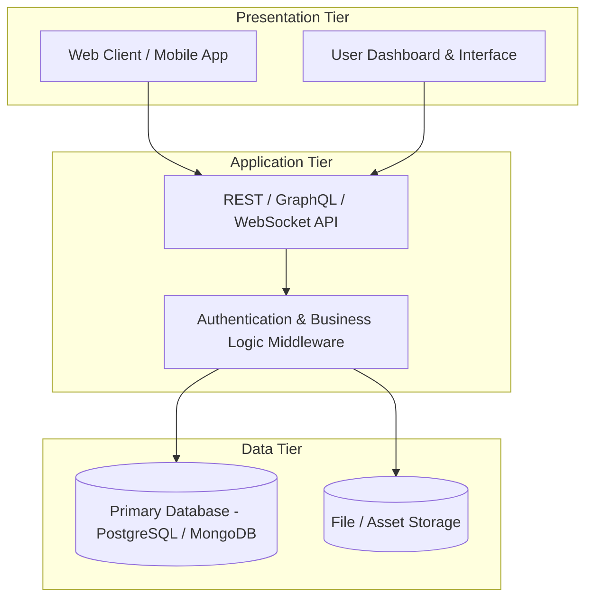

# 🎓 [Insert Your Capstone Project Title Here]

[](./docs/chapters/CHAPTER_1_INTRODUCTION.md)
[](./docs/README.md)
[](./LICENSE)

> **Project Subtitle / Scope Summary:** *[Insert 1-2 sentence high-level description of your capstone project, system, or research study here].*

---

## 👥 Team Roster & Academic Supervision

| Role | Name | Specialization / Focus Area | Contact Email |
| :--- | :--- | :--- | :--- |
| **Project Lead** | `[Student 1 Name]` | Project Architecture, Coordination & Integration | `student1@university.edu` |
| **Developer / Engineer** | `[Student 2 Name]` | Core Development & Backend Logic | `student2@university.edu` |
| **Frontend / UI/UX** | `[Student 3 Name]` | Client Application & Design System | `student3@university.edu` |
| **Technical Writer / QA** | `[Student 4 Name]` | Manuscript Documentation & Quality Evaluation | `student4@university.edu` |
| **Capstone Adviser** | `[Faculty Adviser Name, Title]` | Faculty Adviser, Department of Computer Science | `adviser@university.edu` |

---

## 📁 Repository Directory Structure

```
├── .github/                       # GitHub workflows & team templates
│   ├── ISSUE_TEMPLATE/            # Academic task & revision issue templates
│   └── PULL_REQUEST_TEMPLATE.md   # Standard PR template with chapter links
├── docs/                          # Complete Thesis Manuscript & Academic Docs
│   ├── chapters/                  # Chapters 1 to 5 Markdown source drafts
│   │   ├── CHAPTER_1_INTRODUCTION.md
│   │   ├── CHAPTER_2_LITERATURE_REVIEW.md
│   │   ├── CHAPTER_3_METHODOLOGY.md
│   │   ├── CHAPTER_4_RESULTS_AND_DISCUSSION.md
│   │   └── CHAPTER_5_CONCLUSION_AND_RECOMMENDATIONS.md
│   ├── revisions/                 # Official Adviser Revision Compliance Matrix
│   │   └── REVISION_MATRIX.md
│   ├── minutes/                   # Weekly standups & adviser consultation minutes
│   │   └── MEETING_MINUTES_TEMPLATE.md
│   └── architecture/              # System block diagrams, ERDs, API contracts
│       └── SYSTEM_ARCHITECTURE.md
├── src/                           # Source code (Web Platform & CapStoneFlow Tracker)
│   ├── components/                # Modular UI components (Kanban, Gantt, Reports)
│   ├── context/                   # State management & persistent storage
│   ├── types/                     # TypeScript definitions
│   └── data/                      # Clean project schema & templates
├── CONTRIBUTING.md                # Team git branching & commit guidelines
└── README.md                      # Project master overview
```

---

## 🏛️ System Architecture



---

## 📖 Thesis Manuscript Drafts

* 📄 **[Chapter 1: Introduction & Problem Background](./docs/chapters/CHAPTER_1_INTRODUCTION.md)**
* 📄 **[Chapter 2: Review of Related Literature & Studies (RRL)](./docs/chapters/CHAPTER_2_LITERATURE_REVIEW.md)**
* 📄 **[Chapter 3: Methodology & System Architecture](./docs/chapters/CHAPTER_3_METHODOLOGY.md)**
* 📄 **[Chapter 4: Results, Analysis & Evaluation](./docs/chapters/CHAPTER_4_RESULTS_AND_DISCUSSION.md)**
* 📄 **[Chapter 5: Summary, Conclusions & Recommendations](./docs/chapters/CHAPTER_5_CONCLUSION_AND_RECOMMENDATIONS.md)**
* 📝 **[Adviser Revision Compliance Matrix](./docs/revisions/REVISION_MATRIX.md)**

---

## 🚀 Running the CapStoneFlow Tracker Locally

```bash
# 1. Install dependencies
npm install

# 2. Start the workflow tracker dev server
npm run dev

# 3. Open http://localhost:5173 in your browser
```
