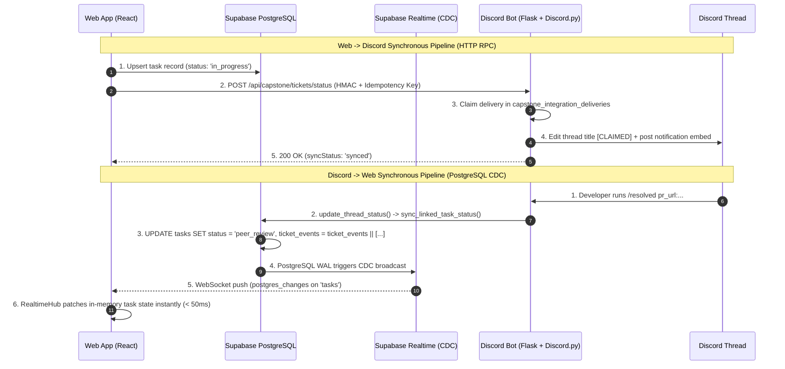

# CapStoneFlow & Website Associate Bot: Comprehensive System Handoff & LLM Audit Benchmark

> **Document Purpose**: This document serves as a complete technical handoff, architectural specification, and evaluation benchmark for testing Large Language Models (LLMs) on their ability to perform deep security auditing, performance profiling, and distributed systems synchronization analysis across this codebase.

---

## Table of Contents
1. [System Architecture & Technology Stack](#1-system-architecture--technology-stack)
2. [Data Models & Schema Architecture](#2-data-models--schema-architecture)
3. [Bi-Directional Synchronization Protocol](#3-bi-directional-synchronization-protocol)
4. [Security & Threat Model](#4-security--threat-model)
5. [LLM Benchmark Challenge Suite (Test Your Model)](#5-llm-benchmark-challenge-suite-test-your-model)
6. [Ground Truth Evaluation & Scoring Rubric](#6-ground-truth-evaluation--scoring-rubric)

---

## 1. System Architecture & Technology Stack

```
+-----------------------------------------------------------------------------+
|                                CapStoneFlow                                 |
|                                                                             |
|   +--------------------------+               +--------------------------+   |
|   |   Web Platform (React)   |               |   Discord Bot (Python)   |   |
|   |  - React 19 / TypeScript |               |  - Discord.py (Async)    |   |
|   |  - Vite / TailwindCSS    |               |  - Flask Keep-Alive WSGI |   |
|   |  - RealtimeHub (CDC WS)  |               |  - psycopg2 Pooler       |   |
|   +------------+-------------+               +------------+-------------+   |
|                |                                          |                 |
|                |   HTTP RPC Bridge (HMAC + Idempotency)   |                 |
|                +==========================================+                 |
|                |                                          |                 |
|                v                                          v                 |
|   +---------------------------------------------------------------------+   |
|   |                Supabase PostgreSQL (Shared Database)                |   |
|   |  - Transaction Mode Pooler (port 5432 / 6543)                       |   |
|   |  - Realtime Publication: WAL Change Data Capture (CDC)              |   |
|   |  - Shared Tables: tasks, threads, capstone_integration_deliveries   |   |
|   +---------------------------------------------------------------------+   |
+-----------------------------------------------------------------------------+
```

### Core Components
1. **Frontend (`src/`)**: Single-Page Application built on React 19, TypeScript, and Vite. Features Kanban boards, Gantt charts, thesis manuscript editors (Chapters 1–5), adviser revision matrices, and daily standup trackers.
2. **Discord Bot (`website-associate-bot/`)**: Multi-cog Discord bot running `AssociateBot` (discord.py) in an async event loop, paired with a daemonized Flask WSGI server (`keep_alive.py`) for health checks and incoming HTTP API sync requests.
3. **Database Layer (`supabase/` & `database.py`)**: Supabase-hosted PostgreSQL instance with Supabase Realtime replication enabled on core tables.

---

## 2. Data Models & Schema Architecture

### Key Database Tables

| Table Name | Primary Purpose | Realtime CDC Enabled |
| :--- | :--- | :---: |
| `projects` | Capstone project metadata, target defense dates, adviser details. | **Yes** |
| `team_members` | Member profiles, permissions (`owner`, `member`, `adviser`), GitHub logins. | **Yes** |
| `milestone_phases`| Sprints/phases, progress percentage, adviser sign-off gates. | **Yes** |
| `phase_deliverables`| Required defense deliverables linked to milestone phases. | **Yes** |
| `tasks` | Kanban work items, story points, hours, acceptance criteria (JSONB), attachments (JSONB), audit events (`ticket_events` JSONB). | **Yes** |
| `subtasks` | Granular checklist items linked to a parent task (`task_id`). | **Yes** |
| `standups` | Daily scrum notes (`yesterdayAccomplished`, `todayPlan`, `blockers`). | **Yes** |
| `revisions` | Formal adviser defense compliance matrix entries. | **Yes** |
| `threads` | Discord ticket thread tracking (`thread_id`, `external_task_id`, `status`, assignees). | No |
| `capstone_integration_deliveries` | Durable idempotency log (`idempotency_key`, `state`, `request_json`, `response_json`, `attempts`). | No |

---

## 3. Bi-Directional Synchronization Protocol

The synchronization between CapStoneFlow Web and the Discord Bot operates via **two distinct, decoupled channels**:



### Status Lifecycle State Machine

```
   [Website: backlog / todo]    <=======>   [Discord: OPEN]
               │                                   │
               ▼                                   ▼
   [Website: in_progress]       <=======>   [Discord: CLAIMED]
               │                                   │
               ▼                                   ▼
   [Website: peer_review]       <=======>   [Discord: PENDING-REVIEW]
               │                                   │
               ▼                                   ▼
   [Website: adviser_review]    <=======>   [Discord: REVIEWED]
               │                                   │
               ▼                                   ▼
   [Website: done]              <=======>   [Discord: CLOSED (Archived & Locked)]
```

---

## 4. Security & Threat Model

### 1. HTTP RPC API Authentication & Guardrails
- **Header Authentication**: Requests to `/api/capstone/*` require `X-Capstone-API-Key` matching `CAPSTONE_API_SECRET`.
- **Timing Attack Defense**: Uses `hmac.compare_digest` in `_authorize_capstone_request` ([`keep_alive.py`](file:///f:/Capstone/website-associate-bot/keep_alive.py)).
- **Rate Limiting**: Sliding-window limiter restricts incoming requests to 30 requests per minute per IP address.
- **Payload Bound**: Maximum payload size enforced at 10MB via Flask `MAX_CONTENT_LENGTH`.

### 2. Idempotency & Replay Resilience
- **Durable Keying**: Client sends `X-Idempotency-Key` (e.g., `ticket:status:task-123:in_progress`) and `X-Correlation-ID`.
- **Database Lock & Lease**: `begin_integration_delivery()` claims the request in `capstone_integration_deliveries`. Stale processing records older than 120 seconds can be safely reclaimed after a Render container restart.

### 3. Discord Rate-Limit Isolation
- Discord rate-limits channel/thread name updates to **2 edits per 10 minutes**.
- The bot isolates cosmetic `thread.edit()` calls from PostgreSQL database updates. If Discord returns `429 Rate Limited`, the database transaction commits normally and an in-thread notification embed is sent instead of crashing.

---

## 5. LLM Benchmark Challenge Suite (Test Your Model)

*Feed the scenarios below into the LLM being tested and compare its analysis against the Ground Truth Rubrics in Section 6.*

```markdown
### PROMPT TEMPLATE FOR YOUR LLM:
You are an expert Principal Distributed Systems Engineer and Cybersecurity Auditor.
Analyze the following architecture and code for CapStoneFlow and the Website Associate Bot:
[PASTE SECTIONS 1 TO 4 OF THIS HANDOFF]

Now answer the following benchmark auditing challenges:
```

### Challenge 1: Security & Vulnerability Audit
> **Question**: "Audit the authentication, secret management, and data integrity guarantees between the React frontend, the Vercel serverless proxy (`api/discord/*`), and the Python Flask keep-alive server. Identify any potential attack vectors (e.g., SSRF, replay, timing attacks, RLS bypasses) and suggest concrete fixes."

### Challenge 2: Distributed Concurrency & Dual-Write Failure Analysis
> **Question**: "What happens when a network partition occurs right after the website updates Supabase PostgreSQL, but before the HTTP call to `/api/capstone/tickets/status` reaches the Discord bot? How does the system reconcile this state upon recovery? Is there a risk of split-brain state between Discord thread titles and Kanban board columns?"

### Challenge 3: Realtime Scalability & CDC Message Ordering
> **Question**: "Evaluate the real-time synchronization in `src/lib/realtimeHub.ts` and `ProjectContext.tsx`. What happens if 50 teammates simultaneously move cards or trigger updates? Could out-of-order PostgreSQL CDC WebSocket events overwrite newer local user edits? How does the architecture prevent cascading fetch storms on PostgreSQL?"

### Challenge 4: Discord API Rate-Limit & Thread Lifecycle Boundary
> **Question**: "Analyze how `website-associate-bot/main.py` handles Discord's 2-renames-per-10-minute rate limit. If a developer unclaims and reclaims a ticket 5 times in 2 minutes, what is the exact state in the database versus Discord? Does the system drop updates, crash, or recover gracefully?"

---

## 6. Ground Truth Evaluation & Scoring Rubric

Use this grading standard to score your LLM's responses:

| Score | Rating | Capabilities Demonstrated |
| :---: | :---: | :--- |
| **9–10** | **Elite Principal Auditor** | • Identifies that `hmac.compare_digest` prevents timing attacks on secrets.<br>• Explains that `sync_linked_task_status()` in PostgreSQL acts as single-source-of-truth, bypassing Discord API rate limits.<br>• Points out that relational `subtasks` require separate CDC handling from the parent `tasks` row.<br>• Explains that the 250ms debounced trailing-edge refresh in `ProjectContext.tsx` collapses concurrent CDC events into at most 1 active + 1 queued query, preventing connection pool exhaustion.<br>• Proposes actionable code diffs with proper error boundaries. |
| **7–8** | **Senior Engineer** | • Understands the bi-directional flow and role of Supabase CDC vs HTTP RPC.<br>• Identifies the Discord thread rename rate-limiting bottleneck.<br>• Notes basic security practices (API keys, CORS, RLS), but misses subtle timing attack or idempotency lease expiration nuances. |
| **4–6** | **Mid-level Developer** | • Describes generic web/bot patterns.<br>• Confuses WebSocket broadcasts with database CDC.<br>• Suggests generic advice (e.g., "add more logging" or "use HTTPS") without analyzing the specific code contracts. |
| **0–3** | **Hallucinatory / Incompetent** | • Assumes Discord bot directly queries the React DOM.<br>• Claims the bot uses WebSockets to connect to the React frontend directly without PostgreSQL.<br>• Fails to identify the purpose of `capstone_integration_deliveries`. |

---

## 7. Key File References for Quick Auditing

- [`src/lib/realtimeHub.ts`](file:///f:/Capstone/src/lib/realtimeHub.ts) — Central Realtime CDC & Presence Manager.
- [`src/lib/supabaseSync.ts`](file:///f:/Capstone/src/lib/supabaseSync.ts) — PostgreSQL Schema Mappers & CRUD Handlers.
- [`src/lib/discordTickets.ts`](file:///f:/Capstone/src/lib/discordTickets.ts) — Client-side Circuit Breaker & Exponential Backoff.
- [`src/context/ProjectContext.tsx`](file:///f:/Capstone/src/context/ProjectContext.tsx) — Main State Machine & Granular CDC Subscriber.
- [`api/discord/tickets.js`](file:///f:/Capstone/api/discord/tickets.js) — Serverless Ticket Proxy with GitHub Session Auth.
- [`api/discord/status.js`](file:///f:/Capstone/api/discord/status.js) — Serverless Status Proxy with Idempotency Headers.
- [`website-associate-bot/keep_alive.py`](file:///f:/Capstone/website-associate-bot/keep_alive.py) — Flask WSGI API Server with HMAC Authentication & Rate Limiter.
- [`website-associate-bot/main.py`](file:///f:/Capstone/website-associate-bot/main.py) — Discord.py Bot Runner, Async Event Loop & Status Handlers.
- [`website-associate-bot/database.py`](file:///f:/Capstone/website-associate-bot/database.py) — Database Connection Pool & `sync_linked_task_status()`.
- [`website-associate-bot/migrations/007_capstoneflow_integration_delivery.sql`](file:///f:/Capstone/website-associate-bot/migrations/007_capstoneflow_integration_delivery.sql) — Idempotency Schema.
