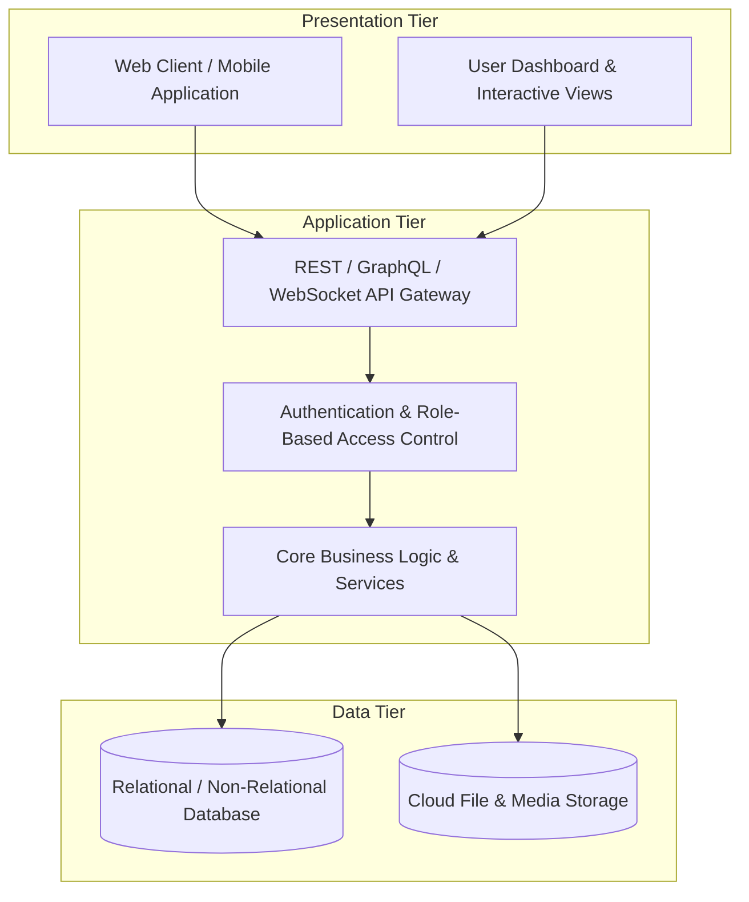
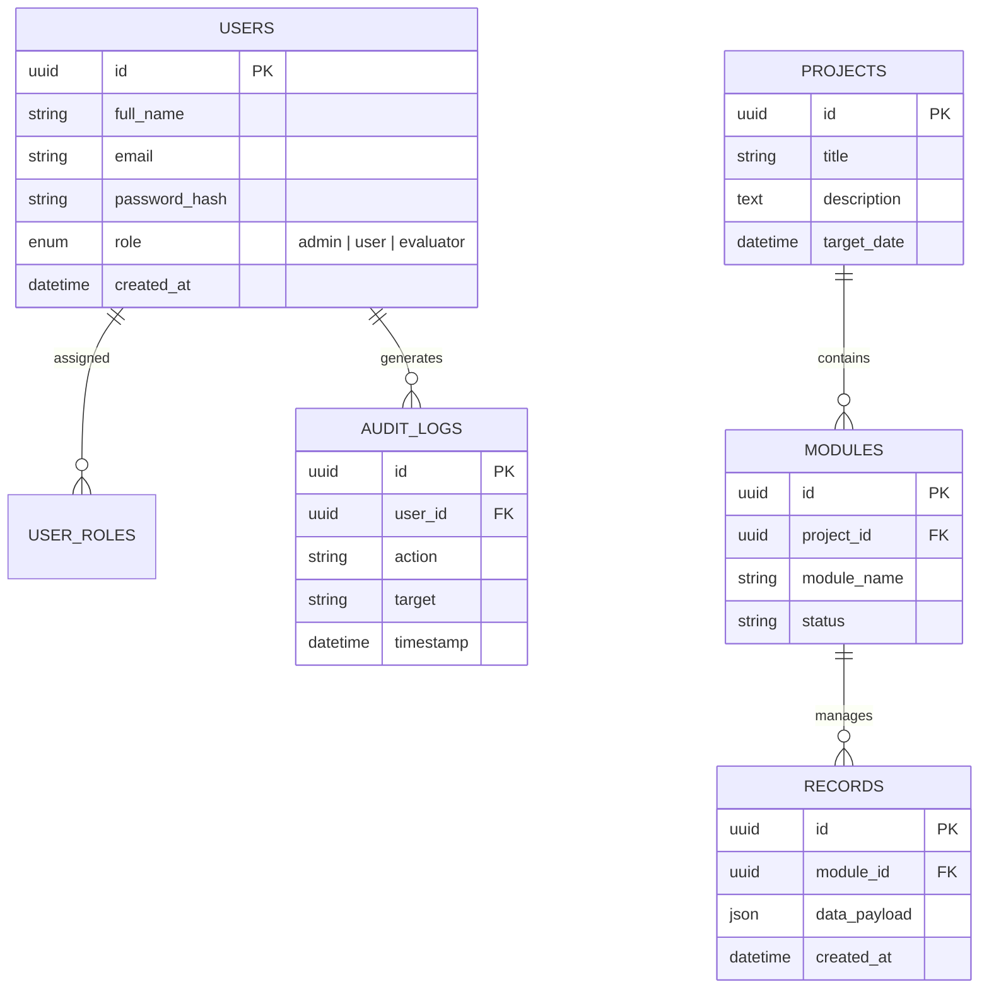

# 🏛️ System Architecture & Technical Specifications

---

## 1. System Architecture Block Diagram

```mermaid
graph TD
    subgraph Client [Presentation Tier]
        A[Web Client / Mobile Application]
        B[User Dashboard & Interactive Views]
    end

    subgraph API [Application Tier]
        C[REST / GraphQL / WebSocket API Gateway]
        D[Authentication & Role-Based Access Control]
        E[Core Business Logic & Services]
    end

    subgraph Data [Data Tier]
        F[(Relational / Non-Relational Database)]
        G[(Cloud File & Media Storage)]
    end

    A --> C
    B --> C
    C --> D
    D --> E
    E --> F
    E --> G
```

---

## 2. Database Entity Relationship Diagram (ERD)

```mermaid
erDiagram
    USERS ||--o{ USER_ROLES : "assigned"
    USERS ||--o{ AUDIT_LOGS : "generates"
    PROJECTS ||--o{ MODULES : "contains"
    MODULES ||--o{ RECORDS : "manages"

    USERS {
        uuid id PK
        string full_name
        string email
        string password_hash
        enum role "admin | user | evaluator"
        datetime created_at
    }

    PROJECTS {
        uuid id PK
        string title
        text description
        datetime target_date
    }

    MODULES {
        uuid id PK
        uuid project_id FK
        string module_name
        string status
    }

    RECORDS {
        uuid id PK
        uuid module_id FK
        json data_payload
        datetime created_at
    }

    AUDIT_LOGS {
        uuid id PK
        uuid user_id FK
        string action
        string target
        datetime timestamp
    }
```
