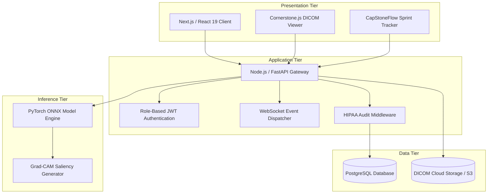
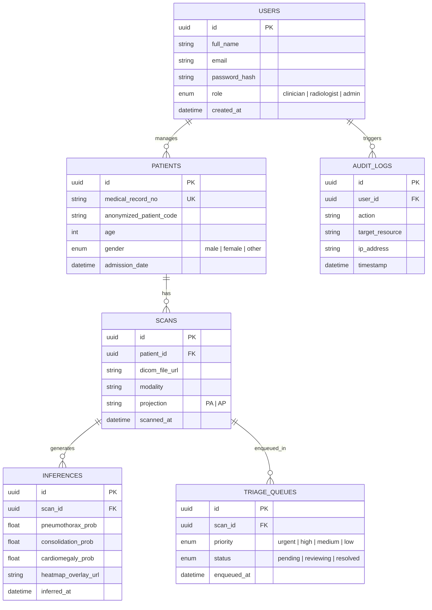

# 🏛️ System Architecture & Database Specifications

---

## 1. System Architecture Block Diagram

```mermaid
graph TD
    subgraph Client [Presentation Tier]
        A[Next.js / React 19 Client]
        B[Cornerstone.js DICOM Viewer]
        C[CapStoneFlow Sprint Tracker]
    end

    subgraph API [Application Tier]
        D[Node.js / FastAPI Gateway]
        E[Role-Based JWT Authentication]
        F[WebSocket Event Dispatcher]
        G[HIPAA Audit Middleware]
    end

    subgraph AI [Inference Tier]
        H[PyTorch ONNX Model Engine]
        I[Grad-CAM Saliency Generator]
    end

    subgraph Data [Data Tier]
        J[(PostgreSQL Database)]
        K[(DICOM Cloud Storage / S3)]
    end

    A --> D
    B --> D
    C --> D
    D --> E
    D --> F
    D --> G
    G --> J
    D --> H
    H --> I
    D --> K
```

---

## 2. Relational Database Schema (ERD)

```mermaid
erDiagram
    USERS ||--o{ PATIENTS : "manages"
    PATIENTS ||--o{ SCANS : "has"
    SCANS ||--o{ INFERENCES : "generates"
    SCANS ||--o{ TRIAGE_QUEUES : "enqueued_in"
    USERS ||--o{ AUDIT_LOGS : "triggers"

    USERS {
        uuid id PK
        string full_name
        string email
        string password_hash
        enum role "clinician | radiologist | admin"
        datetime created_at
    }

    PATIENTS {
        uuid id PK
        string medical_record_no UK
        string anonymized_patient_code
        int age
        enum gender "male | female | other"
        datetime admission_date
    }

    SCANS {
        uuid id PK
        uuid patient_id FK
        string dicom_file_url
        string modality
        string projection "PA | AP"
        datetime scanned_at
    }

    INFERENCES {
        uuid id PK
        uuid scan_id FK
        float pneumothorax_prob
        float consolidation_prob
        float cardiomegaly_prob
        string heatmap_overlay_url
        datetime inferred_at
    }

    TRIAGE_QUEUES {
        uuid id PK
        uuid scan_id FK
        enum priority "urgent | high | medium | low"
        enum status "pending | reviewing | resolved"
        datetime enqueued_at
    }

    AUDIT_LOGS {
        uuid id PK
        uuid user_id FK
        string action
        string target_resource
        string ip_address
        datetime timestamp
    }
```
