# Chapter 2: Review of Related Literature & Studies (RRL)

---

## 2.1 Related Technical & Domain Studies
*(Synthesize recent peer-reviewed journal papers, conference proceedings, and technical literature related to your problem space).*

## 2.2 Comparative Technology & Frameworks Analysis
*(Compare relevant existing platforms, libraries, algorithms, or architectural patterns).*

## 2.3 Synthesis of Related Literature & Research Gap Matrix

| Study / Author (Year) | Proposed Solution / Method | Dataset / Environment | Key Findings & Metrics | Limitations & Research Gap |
| :--- | :--- | :--- | :--- | :--- |
| `[Author et al. (Year)]` | `[System / Algorithm]` | `[Benchmark / Dataset]` | `[Reported Results]` | `[What it lacks / Your gap]` |
| `[Author et al. (Year)]` | `[System / Algorithm]` | `[Benchmark / Dataset]` | `[Reported Results]` | `[What it lacks / Your gap]` |
| **[Your Project Name] (This Study)** | `[Your Architecture / Approach]` | `[Your Target Environment]` | `[Target Metrics]` | **[Addresses gaps via...]** |

---

## 2.4 Conceptual Framework (Input-Process-Output Model)

```mermaid
graph LR
    subgraph Input [INPUT]
        I1[User Inputs / System Requirements]
        I2[Domain Data / Assets]
        I3[User Credentials & Roles]
    end

    subgraph Process [PROCESS]
        P1[Data Validation & Preprocessing]
        P2[Core Business Logic Execution]
        P3[State Management & Sync]
        P4[ISO/IEC 25010 Quality Evaluation]
    end

    subgraph Output [OUTPUT]
        O1[Target System Output & Analytics]
        O2[Audit & Status Reports]
        O3[Validated Software Platform]
    end

    Input --> Process
    Process --> Output
```

---

## 2.5 Definition of Terms
* **[Term 1]:** `[Operational / technical definition as used in this study]`
* **[Term 2]:** `[Operational / technical definition as used in this study]`
* **[Term 3]:** `[Operational / technical definition as used in this study]`
