# Chapter 2: Review of Related Literature & Studies (RRL)

---

## 2.1 Radiography and Emergency Triaging Bottlenecks
Review existing healthcare operations research on emergency department turnaround times, diagnostic error rates under physician fatigue, and the clinical impact of prioritization queues.

## 2.2 Deep Learning Architectures in Medical Imaging
Detailed comparative review of state-of-the-art computer vision models applied to medical radiography:
* **Convolutional Neural Networks (CNNs):** ResNet-50, DenseNet-121, EfficientNet-B4.
* **Vision Transformers (ViTs):** Swin Transformer, ViT-B/16, Hybrid Convolutions.
* **Explainable AI (XAI):** Grad-CAM, Score-CAM, Integrated Gradients for clinical saliency maps.

## 2.3 Synthesis of Related Literature & Research Gap Matrix

| Study & Author (Year) | Proposed Architecture | Dataset Evaluated | Reported AUC / Metric | Limitations & Research Gap |
| :--- | :--- | :--- | :--- | :--- |
| Rajpurkar et al. (2022) | CheXNet (DenseNet-121) | NIH ChestX-ray14 | AUC = 0.841 | Static evaluation; lacks real-time clinician workflow triage integration. |
| Chen & Patel (2024) | Swin Transformer v2 | MIMIC-CXR | AUC = 0.892 | High GPU compute overhead; unoptimized for low-bandwidth rural clinical clients. |
| **MediScan AI (This Study)** | **Quantized EfficientNet + Swin Hybrid** | **NIH + MIMIC Hybrid** | **Target AUC > 0.88** | **Full-stack real-time triage queue, browser DICOM viewer, and HIPAA audit trail.** |

## 2.4 Conceptual Framework (Input-Process-Output Model)

```mermaid
graph LR
    subgraph Input [INPUT]
        I1[DICOM / CXR Radiograph]
        I2[Patient Vitals & Chief Complaint]
        I3[Physician Access Token]
    end

    subgraph Process [PROCESS]
        P1[DICOM Sanitization & Normalization]
        P2[Deep Learning Anomaly Inference]
        P3[Grad-CAM Saliency Generation]
        P4[Urgency Scoring & WebSocket Dispatch]
        P5[ISO 25010 Quality Evaluation]
    end

    subgraph Output [OUTPUT]
        O1[Color-coded Triage Queue Priority]
        O2[Interactive Radiological Heatmap]
        O3[HIPAA Compliant Audit Log Report]
        O4[Validated Decision Support Platform]
    end

    Input --> Process
    Process --> Output
```

## 2.5 Definition of Terms
* **DICOM (Digital Imaging and Communications in Medicine):** The international standard for medical images and related information.
* **Grad-CAM (Gradient-weighted Class Activation Mapping):** A technique for producing visual explanations for decisions from convolutional networks.
* **Hounsfield Unit (HU):** A quantitative scale for describing radiodensity in radiological imaging.
* **Triage Urgency Index:** Algorithmic composite score calculating patient priority in clinical queues.
