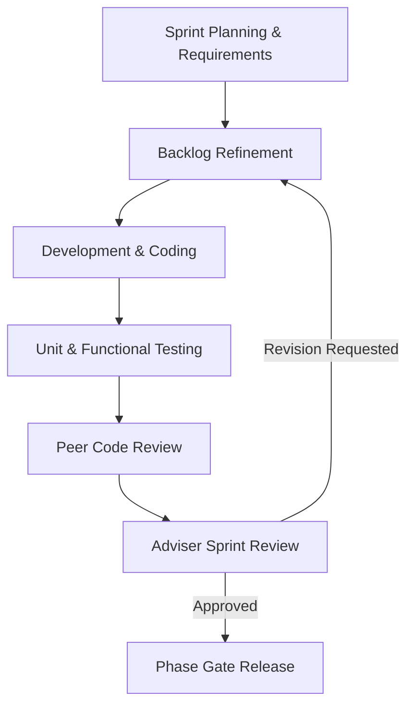

# Chapter 3: Research Methodology & System Architecture

---

## 3.1 Research & Software Engineering Paradigm
*(Detail the software development methodology, such as Agile Scrum, Waterfall, or V-Model, and the sprint iteration structure).*

---

## 3.2 System Architecture & Component Design
*(Provide high-level architecture diagrams, data flow diagrams (DFD), database entity relationship diagrams (ERD), and component breakdowns).*

### 3.2.1 Technology Stack Specifications
* **Frontend:** `[e.g., React / Next.js / TypeScript / Tailwind CSS]`
* **Backend:** `[e.g., Node.js / Python FastAPI / Express]`
* **Database:** `[e.g., PostgreSQL / MySQL / MongoDB with Prisma ORM]`
* **Authentication & Security:** `[e.g., JWT / OAuth / Role-Based Access Control]`

---

## 3.3 Data Gathering & System Procedures
*(Document data collection, dataset curation, API specifications, and ethics clearances).*

---

## 3.4 Development & Implementation Protocol
*(Detail the development environment, version control setup, CI/CD pipeline, and deployment target).*

---

## 3.5 ISO/IEC 25010 Software Quality Evaluation Framework
*(Explain how the system will be evaluated by respondents across the 8 standardized software quality characteristics:)*
1. **Functional Suitability**
2. **Performance Efficiency**
3. **Compatibility**
4. **Usability**
5. **Reliability**
6. **Security**
7. **Maintainability**
8. **Portability**

Scoring is measured using a **5-point Likert Scale** (5 = Excellent/Highly Acceptable, 1 = Poor/Unacceptable).
