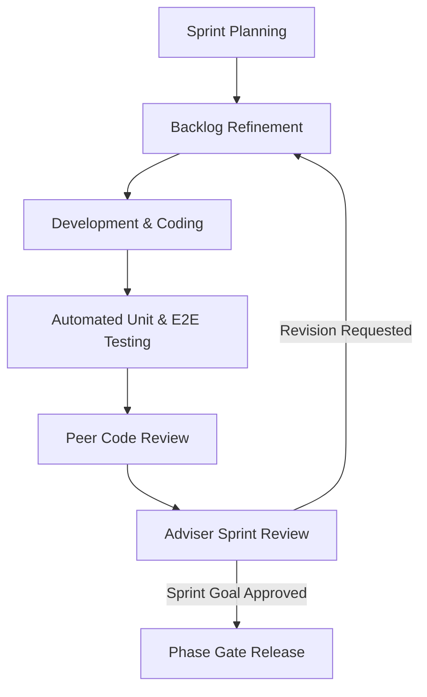

# Chapter 3: Research Methodology & System Architecture

---

## 3.1 Research & Software Engineering Paradigm
The research utilizes an applied experimental research design combined with the **Agile Scrum Framework** for iterative software engineering. The project lifecycle comprises five distinct sprint phases:
1. **Requirements & Scope Engineering**
2. **System Modeling & UX Prototyping**
3. **Core AI Inference & Web Client Sprints**
4. **Integration, Security Audits & Clinical Testing**
5. **Final Defense & Deployment**

---

## 3.2 System Architecture & Component Design
Document the multi-tier microservices/monolithic architecture, API contracts, and database entity relationships (ERD).

### 3.2.1 Component Specifications
* **Frontend:** React 19 + TypeScript + Cornerstone.js for medical rendering + Tailwind CSS.
* **Backend:** Node.js / Python FastAPI REST API with JWT Role-Based Access Control (RBAC).
* **Database:** PostgreSQL (Patient, TriageQueue, ModelInference, AuditLog) with Prisma ORM.
* **Inference Pipeline:** PyTorch / ONNX Runtime serving deep vision inference.

---

## 3.3 Data Gathering, Sanitization & Preprocessing Protocol
Detail dataset acquisition from open clinical repositories (NIH ChestX-ray14 and MIMIC-CXR).

### De-identification & Ethics Compliance:
1. **DICOM Header Scrubbing:** Automated stripping of Patient Name, Medical Record Number (MRN), Date of Birth, and Institution IDs.
2. **Pixel Anonymization:** Cropping peripheral radiographic markers and personal annotations.
3. **Image Normalization:** Resizing to 512x512 with Min-Max intensity normalization and histogram equalization.

---

## 3.4 Neural Network Training & Validation Protocol
* **Loss Function:** Binary Cross-Entropy with Focal Loss for severe class imbalance.
* **Optimization:** AdamW optimizer with cosine annealing learning rate scheduler.
* **Evaluation Metrics:** Receiver Operating Characteristic - Area Under Curve (ROC-AUC), Sensitivity (Recall), Specificity, F1-Score, and 95% Confidence Intervals via 1,000 bootstrapping iterations.

---

## 3.5 ISO/IEC 25010 Software Quality Evaluation Framework
The system will be evaluated by **10 medical and technical practitioners** across 8 standardized software quality characteristics:
1. **Functional Suitability** (Completeness, Correctness, Appropriateness)
2. **Performance Efficiency** (Time behavior, Resource utilization)
3. **Compatibility** (Interoperability, Co-existence)
4. **Usability** (Learnability, Operability, User error protection, User interface aesthetics)
5. **Reliability** (Fault tolerance, Recoverability)
6. **Security** (Confidentiality, Integrity, Non-repudiation, Accountability)
7. **Maintainability** (Modularity, Reusability, Testability)
8. **Portability** (Adaptability, Installability)

Scoring is recorded using a **5-point Likert Scale** (5 = Excellent, 1 = Poor) with weighted mean calculations.
